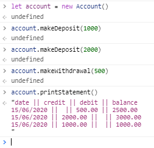
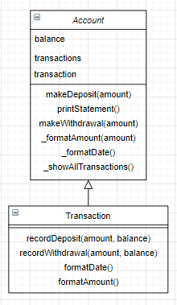

# Bank tech test

This is a practice tech test I did during Week 10 at Makers Academy.

The goal is to produce high quality code while practicing OO desing and TDD skills.

I used Javascript and Jasmine for testing.

## Specification

#### Requirements
* You should be able to interact with your code via a REPL like IRB or the JavaScript console
* Deposits, withdrawal
* Account statement (date, amount, balance) printing
* Data can be kept in memory (it doesn't need to be stored to a database or anything)

#### Acceptance criteria
- Given a client makes a deposit of 1000 on 10-01-2012
- And a deposit of 2000 on 13-01-2012
- And a withdrawal of 500 on 14-01-2012
- When she prints her bank statement
- Then she would see:

```
date || credit || debit || balance
14/01/2012 || || 500.00 || 2500.00
13/01/2012 || 2000.00 || || 3000.00
10/01/2012 || 1000.00 || || 1000.00
```

## How to use
Open `SpecRunner.html` in the browser. This will run all the tests.

In the browser console, create a new instance of account: `let account = new Account()`.  

Call `makeDeposit()`, `makeWithdrawal()` and `printStatement()` methods on the instance, like so:



## Domain Model


There are two classes: account and its dependency: transaction. They have distinct responsibilities in the code. The user only interacts with the account class and its methods directly.

I initialised the project with Javascript and Jasmine, and TDD'd all code. I started out by having only one class for the account, but seeing that a transaction object is created whenever a deposit or withdrawal is done, I abstracted out the transaction.

## Flow diagram

